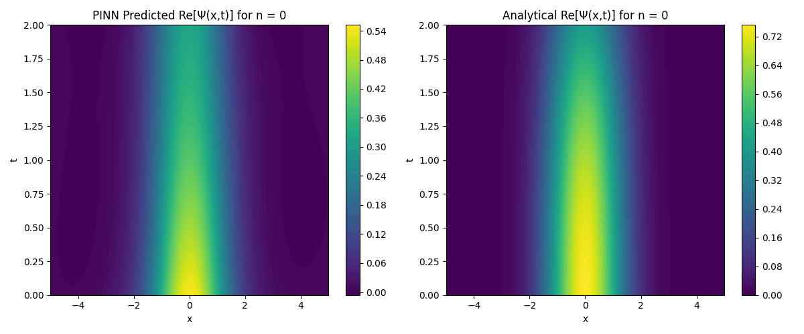
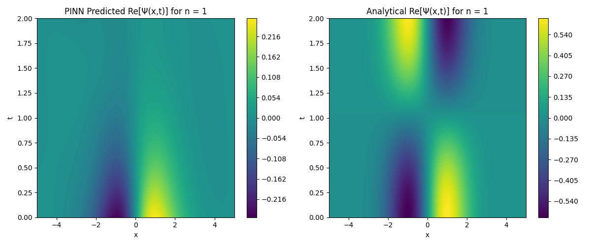

# Schrödinger Equation

## 1. Introduction

The Time-Dependent Schrödinger Equation (TDSE) is a fundamental equation in quantum mechanics that describes how the quantum state of a physical system changes over time.

**Physics-Informed Neural Networks (PINNs)** have emerged as a powerful tool for solving differential equations by embedding the physical laws directly into the loss function of a neural network. In this tutorial, we will employ PINNs to solve the TDSE for the **quantum harmonic oscillator** for different quantum numbers nnn.

We aim to:

- Solve the TDSE for the quantum harmonic oscillator using PINNs for n=0,1
- Visualize the real and imaginary parts of the wave function over space and time.
- Compare the PINN solutions with the analytical solutions.

## 2. Mathematical Background

### **2.1 Quantum Harmonic Oscillator**

The quantum harmonic oscillator is a fundamental model in quantum mechanics, representing a particle subject to a restoring force proportional to its displacement from equilibrium. It is described by the potential energy function:

$$
V(x) = \frac{1}{2} m \omega^2 x^2
$$

For simplicity, we set the mass **m=1** and angular frequency **ω=1** leading to:

$$
V(x) = \frac{1}{2}x^2
$$

### 2.2. Time-Dependent Schrödinger Equation (TDSE)

The TDSE for a particle in one dimension is given by

$$
i \hbar \frac{\partial \psi(x,t)}{\partial t} = \left( - \frac{\hbar^2}{2m} \frac{\partial^2}{\partial x^2} + V(x) \right) \psi(x,t) 
$$

Again, setting ℏ=1 and m=1:

$$
i \frac{\partial \psi(x,t)}{\partial t} = \left( - \frac{1}{2} \frac{\partial^2}{\partial x^2} + V(x) \right) \psi(x,t) 
$$

Substituting $V(x) = \frac{1}{2} x^2$

$$
i \frac{\partial \psi(x,t)}{\partial t} = - \frac{1}{2} \frac{\partial^2 \psi(x,t)}{\partial x^2} + \frac{1}{2} x^2 \psi(x,t) 
$$

### 2.3. Energy Eigenfunctions and Eigenvalues

The quantum harmonic oscillator has well-known solutions for the time-independent Schrödinger equation (TISE):

$$
\frac{1}{2} \frac{d^2 \psi_n(x)}{dx^2} + \frac{1}{2} x^2 \psi_n(x) = E_n \psi_n(x)
$$

The eigenfunctions $\psi_n(x)$ are: 

$$
\psi_n(x) = \left( \frac{1}{\sqrt{\pi} 2^n n!} \right)^{1/2} e^{-x^2 / 2} H_n(x) 
$$

- $H_n(x)$ are the Hermite polynomials.
- n is the quantum number ( n=0,1,2,…n)

The corresponding energy eigenvalues are:

$$
E_n = n + \frac{1}{2}
$$

The time-dependent solutions are then:

$$
\psi_n(x,t) = \psi_n(x) e^{-i E_n t}
$$

## 3. Physics-Informed Neural Networks (PINNs)

### 3.1. Concept of PINNs

Physics-Informed Neural Networks (PINNs) are neural networks that incorporate physical laws (represented by differential equations) into the loss function during training. This approach allows the neural network to learn solutions that satisfy the governing equations, initial conditions, and boundary conditions.

**Advantages of PINNs:**

- They can handle high-dimensional problems.
- They require fewer data points since they leverage the underlying physics.
- They can generalize well to unseen regions within the domain.

### 3.2. Formulating the Loss Function

The loss function for a PINN solving the TDSE consists of two main components:

1. **Physics Loss $L(physics)$**: Ensures that the neural network's output satisfies the TDSE throughout the domain.
2. **Initial Condition Loss $L(IC)$**: Ensures that the solution matches the initial condition at t=0

3.2.1. Physics Loss $L(physics)$

We define the residual of the TDSE:

$$
R(x, t) = i \frac{\partial \psi}{\partial t} + \frac{1}{2} \frac{\partial^2 \psi}{\partial x^2} - \frac{1}{2} x^2 \psi(x, t) 
$$

Since $\psi(x,t)$ is complex, we represent it as

$$
\psi(x, t) = \psi_{\text{Re}}(x, t) + i \psi_{\text{Im}}(x, t) 
$$

Compute the residual components:

- Real Part:

$$
R_{\text{Re}}(x, t) = - \frac{\partial \psi_{\text{Im}}}{\partial t} + \frac{1}{2} \frac{\partial^2 \psi_{\text{Re}}}{\partial x^2} - \frac{1}{2} x^2 \psi_{\text{Re}} 
$$

- Imaginary Part:

$$
R_{\text{Im}}(x, t) = \frac{\partial \psi_{\text{Re}}}{\partial t} + \frac{1}{2} \frac{\partial^2 \psi_{\text{Im}}}{\partial x^2} - \frac{1}{2} x^2 \psi_{\text{Im}} 
$$

The physics loss is then:

$$
L_{\text{physics}} = \frac{1}{N_f} \sum_{i=1}^{N_f} \left( R_{\text{Re}}^2(x_f(i), t_f(i)) + R_{\text{Im}}^2(x_f(i), t_f(i)) \right) 
$$

Where:

- $N_f$ is the number of collocation points.
- $(x_f(i), t_f(i))$ are points sampled within the domain.

3.2.2.1. Initial Condition Loss $L(IC)$

The initial condition loss ensures the solution matches the initial wave function at

t=0.

$$
L_{\text{IC}} = \frac{1}{N_i} \sum_{i=1}^{N_i} \left| \psi_{\text{NN}}(x_i(i), 0) - \psi_{\text{IC}}(x_i(i)) \right|^2 
$$

where:

$N_i$ is the number of initial condition points.

$\psi_{\text{NN}}(x_i(i), 0)$ is the neural network's prediction at t=0.

$\psi_{\text{IC}}(x_i(i))$  is the initial wave function.

3.2.3. Total Loss Function

The total loss is the sum of the physics loss and the initial condition loss:

$$
L_{total}=L_{physics}+L_{IC}
$$

3.2.2.2. Computing Hermite Polynomials

The Hermite polynomials $H_n(x)$ are defined via Rodrigues' formula:

$$
H_n(x) = (-1)^n e^{x^2} \frac{d^n}{dx^n} \left( e^{-x^2} \right)
$$

3.2.2.3. Initial Wave Function for Arbitrary n

The initial wave function $\psi_{\text{IC}}(x)$ is given by the n-th eigenfunction:

$$
\psi_{\text{IC}}(x) = \psi_n(x) = \left( \frac{1}{\sqrt{\pi} 2^n n!} \right)^{1/2} e^{-x^2 / 2} H_n(x) 
$$

Normalization Constant:

$$
N_n = \left( \frac{1}{\sqrt{\pi} 2^n n!} \right)^{1/2} 
$$

---

 

## 4. Network

This network is a simple network just for learning propose:

1. **Input Layer**:
    - The network starts with **2 input nodes**.represent x,t.
2. **Hidden Layers**:
    - The network has **three hidden layers** with the following number of nodes:
        - **First hidden layer**: 256 nodes.
        - **Second hidden layer**: 64 nodes.
        - **Third hidden layer**: 32 nodes.
3. **Output Layer**:
    - The network has **2 output nodes**, $Re(\psi(x,t)), Im (\psi(x,t))$

### 5. Results:

[wave_function_evolution_real_imag_n0.mp4](results/wave_function_evolution_real_imag_n0.mp4)

[wave_function_evolution_real_imag_n1.mp4](results/wave_function_evolution_real_imag_n1.mp4)
